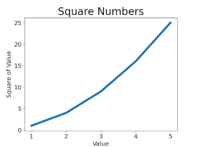
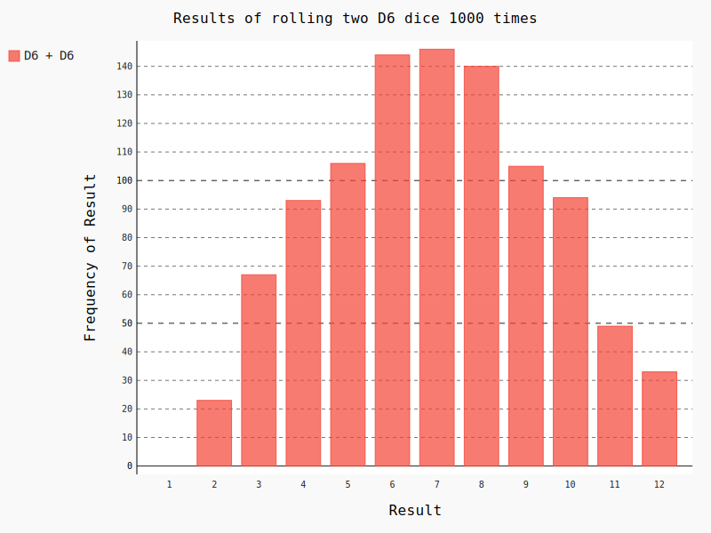
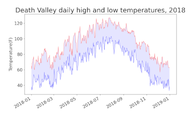
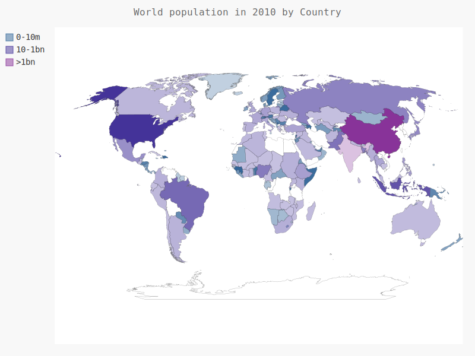
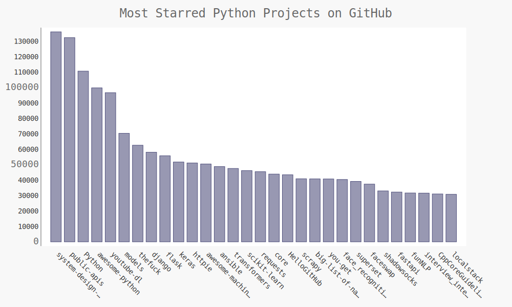

# Studies in Python Graphing and Visualization
This is my personal workspace to try out data visualization libraries
in Python. The libraries featured are matplotlib and pygal.

## Project Configuration Instructions
- Install Python >= 3.9
- `python -m venv project_env`
- `./project_env/Scripts/activate`
- `pip install -r requirements.txt`

## `mpl_squares.py`

Demonstrates one of the most basic uses of matplotlib. This is essentially
a HelloWorld of this graphing library.  

To run:  
`python mpl_squares.py`

## `rw_visual.py`

Visualizes a random walk using the gradient feature of matplotlib.  
  
To run:  
`python rw_visual.py`

## `dice_visual.py`

Use Pygal to make an interactive SGV file of a histogram
of many trials of rolling dice

To run:  
`python dice_visual.py`

## `highs_lows.py`

Reads data in CSV format and plots it out using matplotlib pyplot

To run:  
`python highs_lows.py`

## `world_polulation.py`

Uses pygal to make an interactive SVG of world population by country.

To run:  
`python -m population`

## `python_repos.py`

Uses the GitHub public API to chart the most starred public Python repos

To run:  
`python -m apis/python_repos.py`